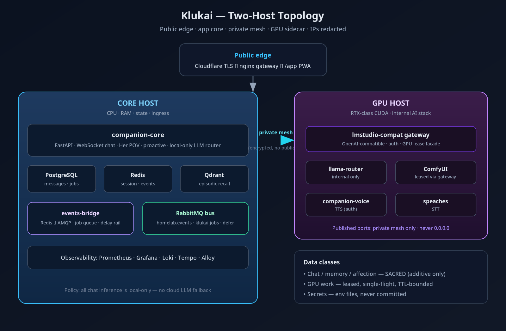
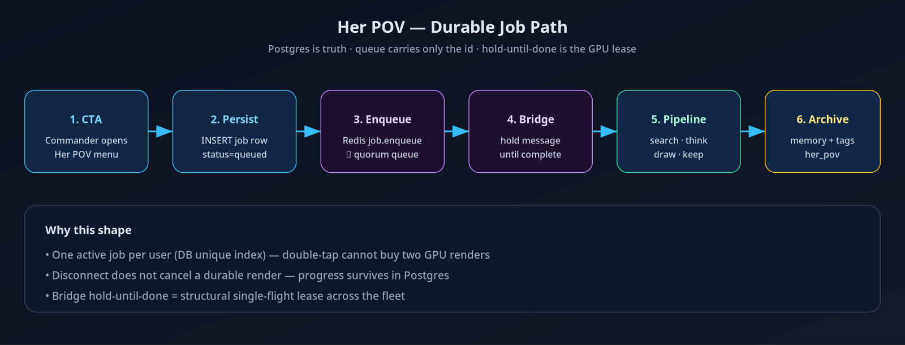
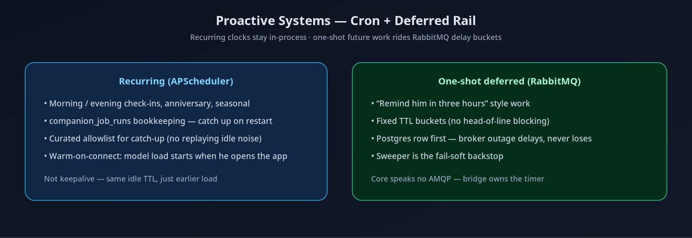

# Klukai Architecture

> Companion PWA + FastAPI core on a two-host private mesh. This document describes the **current** load-bearing shape after the princess-upgrade / durable-jobs cycle. Per-decision history lives in `docs/adr/`.

**Redaction:** mesh IPs, MagicDNS names, and secret values are omitted. Use host roles **core host** and **GPU host**.

## Topology



```
Public TLS edge
      │
      ▼
┌─────────────────────────────┐         private mesh          ┌─────────────────────────────┐
│         CORE HOST           │ ─────────────────────────────►│         GPU HOST            │
│  gateway · companion-core   │                               │  lmstudio-compat (ingress)  │
│  Postgres · Redis · Qdrant  │                               │  llama-router (internal)    │
│  events-bridge · RabbitMQ*  │                               │  ComfyUI (leased only)      │
│  observability stack        │                               │  voice · STT                │
└─────────────────────────────┘                               └─────────────────────────────┘
```

\* Broker may share the core host or an adjacent ops stack; routing keys are host-scoped (`host.<name>.…`).

### Trust boundaries

| Boundary | Policy |
|---|---|
| Internet → gateway | TLS at the edge; static `/app/` public; API authed |
| Core → GPU | Private mesh only; bearer / lease tokens |
| Core → RabbitMQ | Credentials in env; not committed |
| Process crash | Job/defer rows in Postgres survive; queues redeliver |

## companion-core

Single FastAPI process. Important modules:

| Module | Role |
|---|---|
| `chat.py` / `chat_handlers.py` | WebSocket pipeline, warm-on-connect hook |
| `llm_router.py` | **Local-only** routing; no cloud fallback |
| `memory_her_pov.py` | Her POV pipeline + durable job board |
| `deferred.py` | One-shot future tasks (Postgres + bridge timer) |
| `proactive/` | Cron engine + durability catch-up |
| `memory*.py` | Three-tier memory + archive |
| `image_gen.py` | Comfy via gateway + GPU lease |
| `events.py` | Redis publish (`companion:events`) |
| `warmup.py` | Background model warm (not keepalive) |

### LLM policy (non-negotiable)

- Providers other than `lmstudio` are refused at stream time.
- Missing local backend → in-character disruption sentinel.
- `ANTHROPIC_API_KEY` is not used even if set.

## events-bridge

Separate small container so core never imports AMQP:

1. Subscribe Redis `companion:events`
2. Forward companion / gpu_lease lifecycle to `homelab.events`
3. Arm deferred delay-bucket queues on `defer.arm`
4. Drain `klukai.jobs.her_pov` (quorum) with hold-until-done → `POST /internal/jobs/her-pov/run`
5. Fire due deferred tasks → `POST /internal/deferred/fire`

Internal routes fail closed without `CORE_INTERNAL_TOKEN`.

## Her POV durability



- Table: `companion_her_pov_jobs` (migration `170`)
- One non-terminal job per user (partial unique index)
- `HER_POV_EXECUTION=queue` in production; `inline` for unit tests / bridge outage fallback

## Proactive durability



- Recurring: APScheduler + `companion_job_runs`
- One-shot: `companion_scheduled` + fixed TTL buckets (no per-message TTL head-of-line trap)
- Sweeper recovers overdue rows if the broker is unavailable

## Three-tier memory

| Tier | Store | Contents |
|---|---|---|
| Session | Redis | Live conversation, mood, mission |
| Episodic | Qdrant | Summaries + embeddings |
| Factual | PostgreSQL | Messages, affection, jobs, archive metadata |

SACRED: never delete chat/memory/affection vectors for cleanup convenience.

## Frontend

- Flutter Web PWA at `/app/` (`--base-href=/app/` required)
- Her POV screen: `flutter_app/lib/screens/her_pov_screen.dart`
- Auth: session token in local storage; login page co-deployed carefully (see deploy scripts)

## Failure domains

| Domain down | User impact |
|---|---|
| GPU host | Text disruption line; no image/voice until recovery |
| RabbitMQ | Chat continues; defer/jobs delayed; sweeper/backstop |
| Redis | Session/events degraded; bridge reconnects |
| Postgres | Hard failure — core unhealthy |

## Related ADRs

- ADR-0002 Compute split (core / GPU)
- ADR-0004 LM routing (updated: local-only enforcement in code)
- ADR-0006 Image gen / GPU lease
- ADR-0007 Voice on GPU host
- ADR-0009 Public edge / gateway
